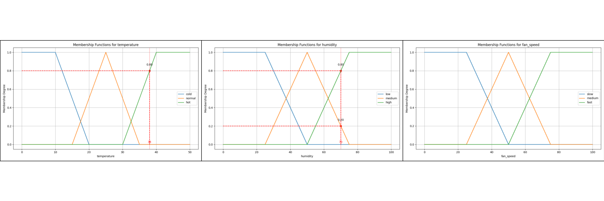
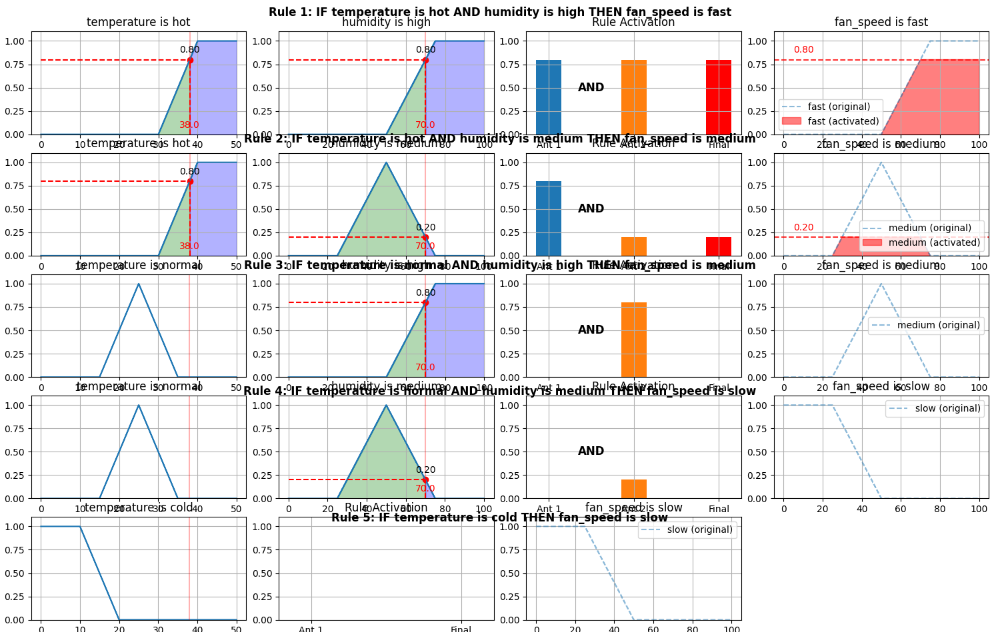
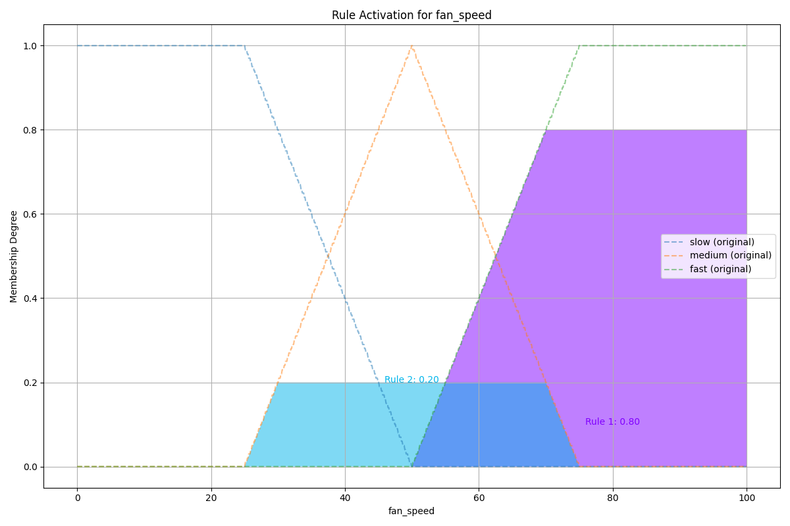
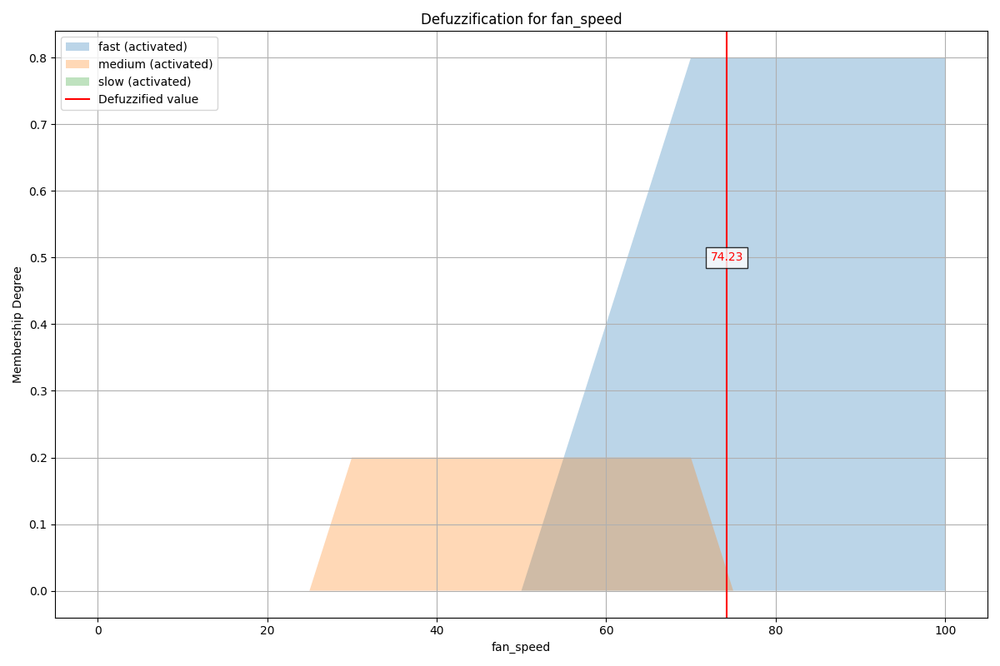
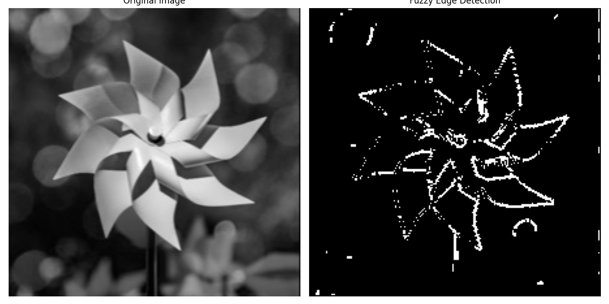

# fuzzBuzz: FUZZY INFERENCE SYSTEM FROM SCRATCH

## Library Usage Example
Control ***Fan Speed*** based on ***temperature*** and ***humidity***  
1. Without visualization plots
    ```
    python usage.py
    ```

2. With visualization plots  
    - Install numpy and matplotlib
        ```
        pip install numpy matplotlib
        ```
    - Usage:
        ```
        python usage_viz.py
        ```

### Plots
1. Membership functions of input and output variables along with fuzzification of input variables


2. Detailed Rule Activation


3. Combined Rule Activation


4. Defuzzification


## Application: Edge Detection
- Install opencv-contrib  
    ```
    pip install opencv-contrib-python
    ```  
- Usage
    ```
    python main.py <image_path> <threshold: [0-100] Default: 25>
    ```
- Example Usage
    ```
    python main.py pictures/pic1.jpg 18 
    ```
    

## Reusable Geometric Utility Classes & Functions
1. **utils/line.py**
    - Point Dataclass
    - Line Class:  
        Modeled using **y = mx + c**  
        Handled vertical line edge-case
    - Intersection calculation functions for both **lines** and **line-segements**
2. **utils/polygon.py**
    - Polygon Class
    - combinePolygons function  
        Targeted just for trapezoids, triangles and their portions whose one side sits on X-axis
3. **utils/centroid.py**
    - Area calculation funtion of polygon
    - Centroid calculation function of polygon

## Slides And Report

- [Slides](https://www.canva.com/design/DAGiOwB3TgA/v1Wj3aIDmYgRkn2YgjKFVw/view?utm_content=DAGiOwB3TgA&utm_campaign=designshare&utm_medium=link2&utm_source=uniquelinks&utlId=heee403f98f)
- [Report](https://drive.google.com/file/d/1WepIbAxIZjG0IXU3KQDzVZO7tsqLnRZA/view?usp=sharing)
